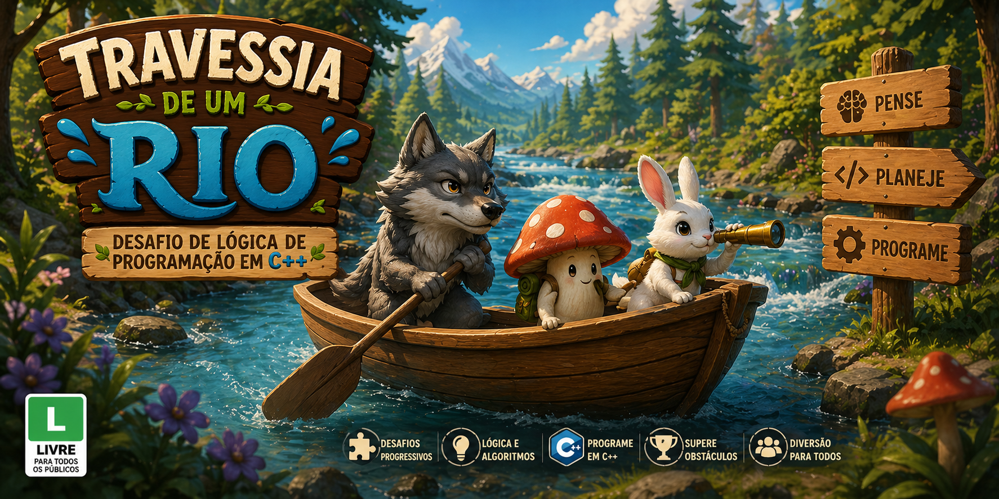

# Jogo da Travessia — Simulação Interativa

<p align="center">
  
</p>


---

## Descrição

O **Jogo do Barquinho** é um sistema interativo desenvolvido em Python que simula um jogo simples em ambiente de terminal, onde o usuário interage com mecânicas básicas de movimentação e tomada de decisão.

O problema abordado é a necessidade de praticar lógica de programação de forma dinâmica e aplicada. Como solução, o projeto apresenta um jogo leve e interativo, permitindo ao usuário compreender na prática estruturas como decisões, repetições e controle de fluxo.

O impacto do projeto está no fortalecimento da base lógica do desenvolvimento, sendo ideal como exercício introdutório para criação de jogos e sistemas interativos.

---

## Objetivo

* Praticar lógica de programação com Python
* Desenvolver um jogo interativo em terminal
* Aplicar estruturas condicionais e loops
* Trabalhar controle de fluxo e interação com o usuário
* Consolidar fundamentos de programação

---

## Tecnologias

* Python 3

---

## Preview

<!-- Sugestões:
- Tela inicial
- Execução do jogo no terminal
- Interações do jogador -->

---

## Como executar

```bash
# Clone o repositório
git clone https://github.com/emanuelekm/Jogo_Barquinho.git

# Acesse a pasta
cd Jogo_Barquinho

# Execute o sistema
python arquivo.py
```

---

## Funcionalidades

* Interação com o usuário via terminal
* Sistema de decisões (escolhas do jogador)
* Simulação de movimentação do barquinho
* Fluxo de jogo com início, progresso e fim
* Feedback em tempo real no terminal

---

## Aprendizados

* Criação de jogos simples em Python
* Uso de estruturas condicionais (`if/elif`)
* Aplicação de laços de repetição (`while`)
* Controle de fluxo baseado em escolhas do usuário
* Organização de lógica de jogo

---

## Melhorias Futuras

* Interface gráfica (Tkinter ou Pygame)
* Sistema de pontuação
* Níveis de dificuldade
* Sons e efeitos visuais
* Expansão da mecânica do jogo

---

## Links

* Repositório: https://github.com/emanuelekm/Jogo_Barquinho.git

